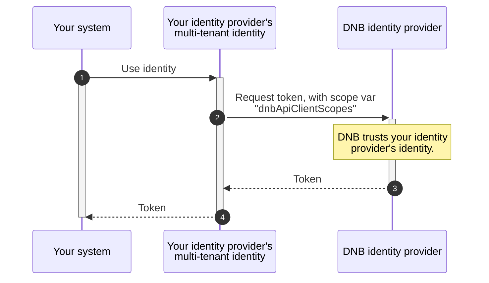

# DNB API Entra ID Federation 🏦 - Configuration

This document describes how to configure DNB API Entra ID Federation.

## Overview

## What is required for configuration?

You receive the following variable values from DNB:

| Variable | Explanation and/or value
|-|-
| `dnbAuthorityUri`     | `https://login.microsoftonline.com:443/9ecbd628-0072-405d-8567-32c6750b0d3e`, the authority of the [authorization server](https://datatracker.ietf.org/doc/html/rfc6749#section-1.1).
| `dnbApiClientScopes`  | The [access token scope](https://datatracker.ietf.org/doc/html/rfc6749#section-3.3) of a specific DNB API. You will receive a unique scope for each DNB API you want to access as a partner.

You send the following variable values to DNB:

| Variable | Explanation
|-|-
| `partnerIdentityClientId`   | The [application (client) ID](https://learn.microsoft.com/en-us/azure/healthcare-apis/register-application#application-id-client-id) of your Microsoft Entra ID [multi-tenant](https://learn.microsoft.com/en-us/entra/identity-platform/howto-convert-app-to-be-multi-tenant#update-registration-to-be-multitenant) app registration.
| `partnerTenantId`   | The [Directory (tenant) ID](https://learn.microsoft.com/en-us/entra/fundamentals/how-to-find-tenant) of your Microsoft Entra ID tenant.

## How to make it work?

We provide sample configurations in the following languages and frameworks to help you set up DNB API Entra ID Federation. Replace all text in angle brackets (e.g., `<replace-me>`) with your own and DNB-provided values, and remove the brackets.

| Sample | Description
|-|-
| [HTTP](/DnbApiEntraIdFederationSamples/plainHttpEntraId.http) | Uses [Huachao Mao's REST Client](https://marketplace.visualstudio.com/items?itemName=humao.rest-client) for VS Code.
| [.NET](/DnbApiEntraIdFederationSamples/dotnetEntraId/Program.cs) | Uses the [Microsoft Authentication Library (MSAL) for .NET](https://learn.microsoft.com/en-us/dotnet/api/microsoft.identity.client?view=msal-dotnet-latest).
| [Java](/DnbApiEntraIdFederationSamples/javaEntraId/app/src/main/java/App.java) | Uses [MSAL4J](https://learn.microsoft.com/en-us/entra/msal/java/). Built with Gradle.
