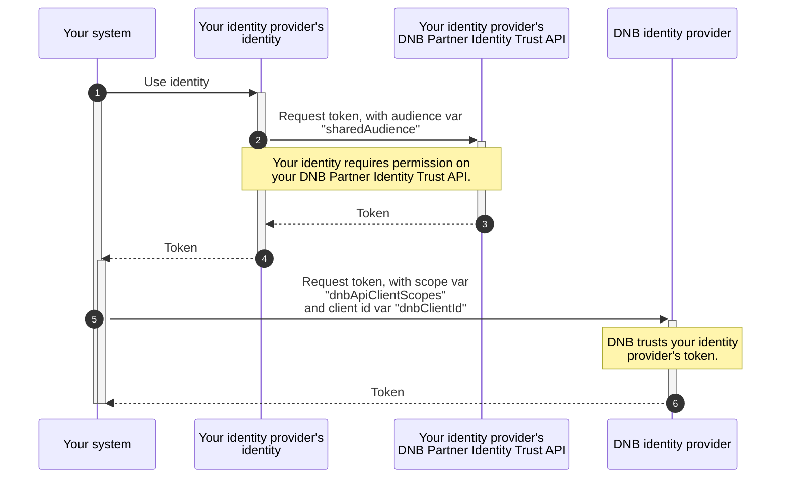

# DNB API Identity Federation 🏦 - Configuration

This document describes how to configure DNB API Identity Federation.

## Overview



## What is required for configuration?

You receive the following variable values from DNB:

| Variable | Explanation and/or value
|-|-
| `sharedAudience`      | `api://DnbPartnerIdentityTrust`, the [audience claim](https://datatracker.ietf.org/doc/html/rfc7519#section-4.1.3) for your internal request to your identity provider's `DNB Partner Identity Trust` API. <br><br>*Please note, although we advise to use the given value for clarity, not all identity providers support setting the audience claim to a user-provided (API) value, we permit other values such as the client-id if no mechanism is available in your system.*
| `dnbAuthorityUri`     | `https://login.microsoftonline.com:443/9ecbd628-0072-405d-8567-32c6750b0d3e`, the authority of the [authorization server](https://datatracker.ietf.org/doc/html/rfc6749#section-1.1).
| `dnbClientId`         | The [client identifier](https://datatracker.ietf.org/doc/html/rfc6749#section-2.2) from a DNB Identity, representing you as a partner at DNB. You will receive a unique client ID for each identity you federate with DNB as a partner.
| `dnbApiClientScopes`  | The [access token scope](https://datatracker.ietf.org/doc/html/rfc6749#section-3.3) of a specific DNB API. You will receive a unique scope for each DNB API you want to access as a partner.

You send the following variable values to DNB:

| Variable | Explanation
|-|-
| `partnerIdentityIssuer`   | The [issuer claim](https://datatracker.ietf.org/doc/html/rfc7519#section-4.1.1) of your identity provider, this must be a valid HTTPS URL.
| `partnerIdentitySubject` | The [subject claim](https://datatracker.ietf.org/doc/html/rfc7519#section-4.1.2), usually the client id of your identity provider's identity.
| `partnerIdentityAudience` | The `sharedAudience` value as explained in the previous table.

## Implementations

We provide sample implementations in the following paragraphs to help you set up DNB API Identity Federation. Replace all text in angle brackets (e.g., `<replace-me>`) with your own and DNB-provided values, and remove the brackets. Many frameworks provide a seamless experience working with the [OAuth 2.0 Token Exchange specification (RFC 8693)](https://datatracker.ietf.org/doc/html/rfc8693), please consult the documentation of your language and/or framework for guidance. If limited, please check the HTTP samples for similar providers for the exact HTTP calls required.

### Auth0

The following implementation samples are based on [Auth0](https://auth0.com/).

| Sample | Description
|-|-
| [HTTP](/DnbApiIdentityFederationSamples/plainHttpAuth0.http) | Uses [Huachao Mao's REST Client](https://marketplace.visualstudio.com/items?itemName=humao.rest-client) for VS Code.
| [.NET](/DnbApiIdentityFederationSamples/dotnetAuth0/Program.cs) | Uses the [Microsoft Authentication Library (MSAL) for .NET](https://learn.microsoft.com/en-us/dotnet/api/microsoft.identity.client?view=msal-dotnet-latest) and the [Auth0 Authentication API](https://github.com/auth0/auth0.net/tree/master?tab=readme-ov-file#authentication-api).
| [Java](/DnbApiIdentityFederationSamples/javaAuth0/app/src/main/java/App.java) | Uses [MSAL4J](https://learn.microsoft.com/en-us/entra/msal/java/) and the [Java client library for the Auth0 platform](https://github.com/auth0/auth0-java). Built with Gradle.

### Entra External ID

The following implementation samples are based on [Microsoft Entra External ID](https://learn.microsoft.com/en-us/entra/external-id/external-identities-overview).

A single-tenant app registration must be configured. The `ciamlogin` token endpoint must be used.

| Sample | Description
|-|-
| [HTTP](/DnbApiIdentityFederationSamples/plainHttpEntraExternalId.http) | Uses [Huachao Mao's REST Client](https://marketplace.visualstudio.com/items?itemName=humao.rest-client) for VS Code.

### Keycloak

The following implementation samples are based on [Cloud-IAM](https://www.cloud-iam.com/), a managed Keycloak service.

A Client Scope `Mapper` must be configured of type `Audience` to add the `aud` claim. Set `Included Custom Audience` to `api://DnbPartnerIdentityTrust` and make sure `Add to access token` is enabled. Attach this Client Scope to your Client. To remove all other audiences, such as the `account` audience value, please refer to [How to remove "account" from aud claim in Keycloak?](https://stackoverflow.com/a/76355966).

| Sample | Description
|-|-
| [HTTP](/DnbApiIdentityFederationSamples/plainHttpKeycloak.http) | Uses [Huachao Mao's REST Client](https://marketplace.visualstudio.com/items?itemName=humao.rest-client) for VS Code.

### Okta

The following implementation samples are based on the [Okta Platform](https://www.okta.com/products/workforce-identity/).

An `Authorization Server` must be configured under `Security - API`, configure this server with audience `api://DnbPartnerIdentityTrust`. Make sure to use the `token_endpoint` found in the `Metadata URI` of your server to get tokens.

| Sample | Description
|-|-
| [HTTP](/DnbApiIdentityFederationSamples/plainHttpOkta.http) | Uses [Huachao Mao's REST Client](https://marketplace.visualstudio.com/items?itemName=humao.rest-client) for VS Code.

### SAP

The following implementation samples are based on [SAP Cloud Identity Services](https://discovery-center.cloud.sap/serviceCatalog/cloud-identity-services/?region=all).

An [OpenID Connect Application for Client Credentials Flow](https://help.sap.com/docs/cloud-identity-services/cloud-identity-services/create-openid-connect-application-299ae2f07a6646768cbc881c4d368dac) must be created. Make sure to configure a [Dependency](https://help.sap.com/docs/cloud-identity-services/cloud-identity-services/communicate-between-applications) in order to have a [single audience claim](https://help.sap.com/docs/cloud-identity-services/cloud-identity-services/consume-api-from-another-application?q=audience+claim).

| Sample | Description
|-|-
| [HTTP](/DnbApiIdentityFederationSamples/plainHttpSAP.http) | Uses [Huachao Mao's REST Client](https://marketplace.visualstudio.com/items?itemName=humao.rest-client) for VS Code.

### Google Cloud

The following implementation samples are based on [Google Cloud's Identity and Access Management (IAM)](https://cloud.google.com/iam/docs/overview).

| Sample | Description
|-|-
| [HTTP](/DnbApiIdentityFederationSamples/plainHttpGoogleCloud.http) | Uses [Huachao Mao's REST Client](https://marketplace.visualstudio.com/items?itemName=humao.rest-client) for VS Code and the [Google Cloud CLI](https://cloud.google.com/sdk/docs/install).
| [.NET](/DnbApiIdentityFederationSamples/dotnetGoogleCloud/Program.cs) | Uses the [Microsoft Authentication Library (MSAL) for .NET](https://learn.microsoft.com/en-us/dotnet/api/microsoft.identity.client?view=msal-dotnet-latest) and the [Google APIs client Library for .NET](https://github.com/googleapis/google-api-dotnet-client).

### AWS

The following implementation samples are based on [Amazon Cognito](https://aws.amazon.com/cognito/), a modern identity service by Amazon Web Services (AWS).

A [pre token generation Lambda trigger](https://docs.aws.amazon.com/cognito/latest/developerguide/user-pool-lambda-pre-token-generation.html) must be configured to add the `aud` claim. Per AWS constraints, the `auth` claim value can only be the pre-defined `clientId` from the called context. The following `Node.js` lambda has been verified to work:

```js
const handler = async (event) => {
  const clientId = event.callerContext.clientId;
  event.response = {
        claimsAndScopeOverrideDetails: {
            accessTokenGeneration: {
                claimsToAddOrOverride: {
                    aud: clientId
                }
            }
        }
  }
  return event;
};
export { handler };
```

| Sample | Description
|-|-
| [HTTP](/DnbApiIdentityFederationSamples/plainHttpAWS.http) | Uses [Huachao Mao's REST Client](https://marketplace.visualstudio.com/items?itemName=humao.rest-client) for VS Code.
